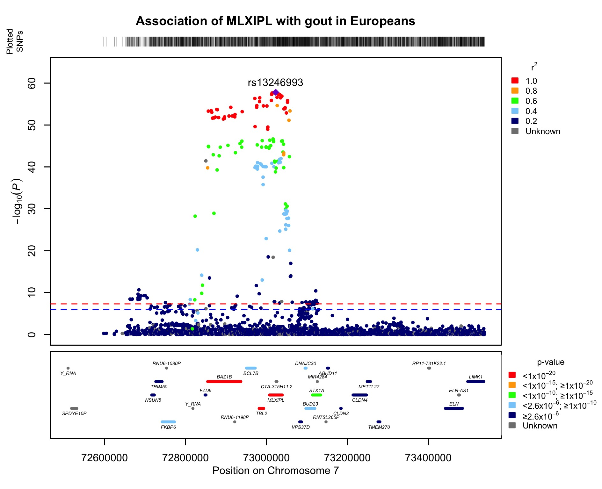

[](https://doi.org/10.5281/zenodo.5154379)

# LocusZooms
## Make LocusZoom-like plots with your own LD matrix.

This script creates an R function to create regional Manhattan plots with points coloured according to LD and genes annotated beneath. Three example input files are included for test purposes, along with an example .jpg output.

This script has one package dependency: `scales`

  - Example.assoc.linear: A file of PLINK association results (only the "CHR", "SNP", "BP", and "P" columns are essential)
  - Example.ld: A file of the LD between the SNP to be labelled (top-hit / SNP of interest) and the SNPs included in the PLINK results file
    - this file MUST have a column called "SNP_B" (containing a list of all the SNPs in the results file) and a column called "R2" (containing the R^2 LD value of each SNP). The SNP names MUST match the names in the SNP column of the results file.
    - this file can be created for you by the locus_zoom.R script IF you have access to the Biochem servers and have rsIDs in your results file, if you are running this script on your local machine you will also need to ensure bcftools and plink2 are installed
  - Example.genes: A file of the genes within the region for use in the annotation step. This file must have five columns, "Gene", "Chrom", "Start", "End", and "Coding". The `{Gencode,UCSC}_GRCh37_Genes_UniqueList{2017,2021}.txt` files can be used for this file.

### Example locus.zoom run:

```
# load necessary files into R
Example.assoc.linear <- read.delim("Example.assoc.linear", stringsAsFactors = FALSE, header = TRUE)
Example.ld <- read.table("Example.ld", stringsAsFactors = FALSE, header = TRUE)
Unique.genes <- read.delim("Gencode_GRCh37_Genes_UniqueList2021.txt", stringsAsFactors = FALSE, header = TRUE)

# load the locuszoom functions into R
for(script in c("check_rsid.R", "elog10.R", "gene_position.R", "get_ld.R", "get_region.R", "locus_zoom.R", "merge_gene_colour.R", "merge_plot_dat.R", "plot_locus.R", "plot_secondary_point.R", "subset_data.R")){
  source(paste0("functions/", script))
}
rm(script)

# create a LocusZoom-like plot
locus.zoom(data = Example.assoc.linear,                                    # a data.frame (or a list of data.frames) with the columns CHR, BP, SNP, and P
           region = c(16, 53340000, 54550000),                             # the chromosome region to be included in the plot
           offset_bp = 0,                                                  # how many basepairs around the SNP / gene / region of interest to plot
           ld.file = Example.ld,                                           # a file with LD values relevant to the SNP specified above
           genes.data = Unique.genes,			                   # a file of all the genes in the region / genome
           plot.title = "Association of FTO with BMI in Europeans",        # the plot title
           file.name = "Example.jpg",                                      # the name of the file to save the plot to
           secondary.snp = c("rs1121980", "rs8060235"),                    # a list of SNPs to label on the plot
           secondary.label = TRUE)                                         # TRUE/FALSE whether to add rsIDs of secondary SNPs to plot
```


### Compulsory flags:

One of `snp`, `gene`, or `region` must be specified to create the plot:

 - `snp`: specify the SNP to be annotated (you must also include `ignore.lead = TRUE` if choosing this option)
 - `gene`: specify the Gene to make the plot around
 - `region`: specify the chromsome region you want to plot (must be specified as `c(chr, start, end)`

As well as each of the following:

 - `data`: specify the data.frame (or a list of data.frames) to be used in the plot (requires the columns "CHR", "BP", "SNP", and either "P" or "logBF")
 - `genes.data`: specify a data.frame with gene locations to plot beneath the graph (requires the columns "Gene", "Chrom", "Start", "End", and "Coding") - the Gencode or UCSC `{Gencode,UCSC}_GRCh37_Genes_UniqueList{2017,2021}.txt` files in this repo can be used for this
 - `plot.title`: specify a title to go above your plot
 - `file.name`: specify a filename for your plot to be saved to

### Optional flags:

 - `ld.file`: specify a data.frame with LD values relevant to the SNP specified by `snp` (requires the columns "SNP_B" and "R2") 
 - `offset_bp`: specify how far either side of the `snp`, `gene`, or `region` you want the plot to extend (defaults to 200000)
 - `psuedogenes`: when using one of the three gene lists in this repo you can specify whether you want to plot the pseudogenes (defaults to FALSE)
 - `RNAs`: when using one of the two gene lists created in 2021 in this repo you can specify whether you want to plot lncRNA and ncRNA genes (defaults to FALSE)
 - `plot.type`: specify the file format of the plot (defaults to "jpg", options are "jpg", "svg", or "view_only" which will not save the plot, but output it to RStudio Viewer instead)
 - `nominal`: specify the nominal significance level to draw on the plot (in -log10(_P_), default is 6 or _P_ = 1e-6)
 - `significant`: specify the significance level to draw on the plot (in -log10(_P_), default is 7.3 or _P_ = 5e-8) 
 - `secondary.snp`: provide the list of secondary SNP IDs (must match IDs in results file) to be highlighted on the plot
 - `secondary.label`: specify whether to label the secondary SNPs on the plot (defaults to FALSE)
 - `secondary.circle`: specify whether to add a red circle around the secondary SNPs on the plot (defaults to TRUE)
 - `genes.pvalue`: specify a data.frame of p-values (e.g. MAGMA results) associated with each gene (requires the columns "Gene" and "P") 
 - `colour.genes`: specify whether to colour genes based on a p-value provided in gene.pvalue (defaults to FALSE)
 - `population`: specify the 1000 genomes population to use when calculating LD if ld.file = NULL (defaults to "EUR", options are "AFR", "AMR", "EAS", "EUR", "SAS", "TAMA", and "ALL")
 - `sig.type`: specify whether the y-axis should be labelled as -log10(_P_) or log10(BF) (defaults to "P", options are "P", "logP", or "logBF"). For the "P" option an additional -log10 conversion of the input "P" column will be performed.
 - `nplots`: specify whether multiple results plots will be saved into your jpeg file (e.g. plot two GWAS results one above another; defaults to FALSE)
 - `ignore.lead`: specify whether to ignore the SNP with the smallest P and use the SNP specified by 'snp' to centre the plot (defaults to FALSE)
 - `rsid.check`: specify whether to check if the SNPs are labelled with rsIDs - should only matter if script is calculating LD for you (defaults to TRUE)
 - `nonhuman`: specify whether the data to plot has come from a non-human sample-set (defaults to FALSE) - if the data going in is from a non-human species make sure the chromosome column is only numbers (e.g. 1 instead of chr1, 23 instead of X).


## Secondary Example:

_This is not reproducible from the example data._

```
locus.zoom(data = EUR_meta_full1_clean_rsid.nfiltered_chr7,
           gene = "MLXIPL",
           offset_bp = 500000,
           genes.data = Gencode_GRCh37_Genes_UniqueList2021,
           plot.title = "Association of MLXIPL with gout in Europeans",
           file.name = "alternateExample.jpg",
           genes.pvalue = MAGMA_EUR_meta_full_Gencode2021,
           colour.genes = TRUE,
           psuedogenes = FALSE,
           RNAs = TRUE)
```



